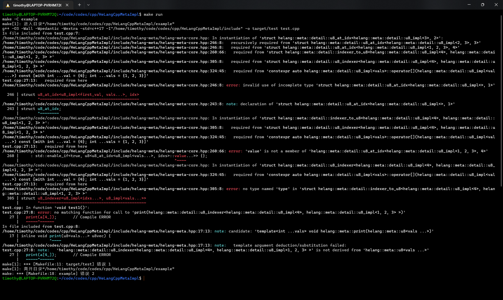
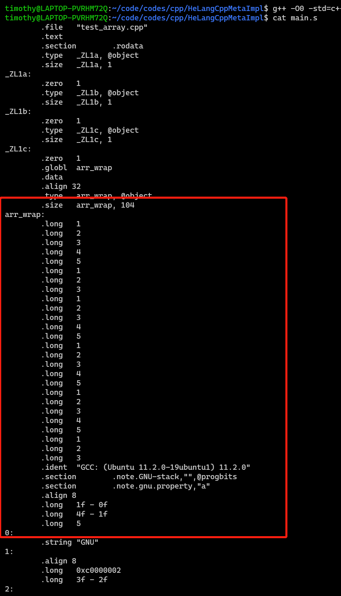

# **HeLangCppMetaImpl**

HelangMeta：何语言（元宇宙版）——何而上语言，次世代赛博元宇宙编程语言  

[TOC]

## 介绍

何而上语言（HelangMeta），是超脱于何语言的新时代编程语言，是何语言在赛博元宇宙的高维形态😍😍😍。  

本项目旨在为生活在普通赛博世界的生命体提供一套窥探更高维度的赛博元宇宙🤖的可靠工具，满足对新赛博世界的一切幻想，引领赛博新时代的潮流，促进生命体的返璞归真。终于，我们认识到，赛博生命体回归最初级的形态——何而上形态，才是赛博生命体的最高形态🤤。  

## 特色

本项目切合高维度生命体返璞归真的要求，紧跟**赛博元宇宙**的步伐，完全采用 **C++ 模板元编程**技术，通过模板的特化、SFINAE 等机制，提供对何语言的 C++ 语法内建支持。并可以 **100% 保证**😊即使在 `-O0` 优化下，仍可以在编译期进行何语言的计算，实现**真正**的运行期**零开销**（zero-overhead）💕。  

通过何而上语言，高维度赛博生命体在普通赛博空间的投影得以展现。  

## 灵感

何而上语言灵感来自：  

+ [kifuan/helang: 何语言，次世代赛博编程语言。 (github.com)](https://github.com/kifuan/helang)
+ [Cyl18/HeLangSharp (github.com)](https://github.com/Cyl18/HeLangSharp)

在此表示衷心的感谢！  

## 特别说明

由于何而上语言位于高维度空间内，只有 GCC 和 Clang 且使用 C++17 及以上才可以感知它的存在。相反，MSVC 目前无能力对其进行感知（编译器内部错误引起的 error C3546）。期待未来巨硬联邦对 MSVC 探索工具进行升级（BUG 修复），以提供对何而上语言的支持。  

## 使用方法

### 运行样例

高维度的生命体提供的样例需要类 UNIX 环境才能完美窥探其奥妙。在类 UNIX 元宇宙实验空间中安装 GNU Make 和支持 C++17 的 `g++` 并运行：  

```shell
$ make run
```

即可运行示例程序 `example/test.cpp`。

你可以向 UNIX 赛博元宇宙实验空间发出环境要求，对其进行自定义，例如使用新时代高维显微利器 `clang++` 对其进行编译：  

```shell
$ CXX=clang++ make run
```

你也可以修改**伟大的实验勘探清单** `Makefile` 更改仪器版本，例如将 `-std=c++17` 改为 `-std=c++20`。  

### 使用何而上语言

1. 下载何而上语言零件集装箱：

   ```shell
   $ git clone https://github.com/Timothy-Liuxf/HeLangCppMetaImpl.git
   ```

2. 将集装箱的 `include` 文件夹置于头文件目录内：

   ```shell
   $ g++ -IHeLangCppMetaImpl/include <其他选项>
   ```

   然后即可开始体验。  

## 语法

要使用何而上语言核心功能，我们需要在文件中引入 `helang-meta-core.hpp` 核心零件：  

```c++
#include <helang-meta/helang-meta-core.hpp>
```

要体验何而上语言完整功能，支持对生命体进行自动化显示，可以引入 `helang-meta.hpp` 完整包（额外包含 `print`、`println` 等操作）：  

```c++
#include <helang-meta/helang-meta.hpp>
```

### 数据类型

著名的《齐物论》中说：”天地与我并生，而万物与我为一“😉。普通赛博空间中，任何生命体，都是赛博元宇宙同一种生命体的不同维度上的投影🤔。因此，赛博元宇宙是真正的万物统一👍。所以，何而上语言仅存在 `u8` 一种类型，其位于 `helang::meta` 分区（namespace）内。因此，要使用 `u8`，我们需要 `using namespace helang::meta`。  

### 字面量（literal）

要直接使用 `u8` 字面量来创建 `u8` 类型，我们需要 `using namespace helang::meta::literals`。  

值得注意的是，在普通赛博空间来窥视高维的赛博元宇宙生命体（以下简称元生命体），其移动速度是难以想象的超光速🤗。且，元生命体遵循超量子理论，海森堡不确定性原理会推广到新的测不准原理，让我们无法掌控它的确切位置😭。因此，给予我们普通空间的局限性，我们观察到的元生命体，均会拖带有彗尾似的重影。所以，与何语言不同，何而上语言的字面量总是带有拖影 `_`。也就是说，我们可以这样定义一个 `u8` 字面量 `a`：  

```c++
u8 a = 1_;
```

### 基本语法

当然，作为何语言的精髓，`|` 仍然作为数组的分隔符：  

```c++
u8 a = 1_ | 2_ | 3_;
println(a);  // 输出 1_ | 2_ | 3_
```

如同何语言一样，何而上语言也遵循 **Saint He** 曾说过的 `whichKey - 1` 的宗旨，下标从 `1` 开始：  

```c++
u8 a = 1_ | 2_ | 3_;
println(a[1_]); // 输出 1_
u8 b = a[2_ | 3_]; // 自然也可以以任意一个 `u8` 作为下标
println(b); // 输出 2_ | 3_
```

何而上语言可以用单独一个 `0_` 作为下标，代表所有的元素：  

```c++
u8 a = 1_ | 2_ | 3_;
println(a[0_]); // 输出 1_ | 2_ | 3_
```

下标越界（例如 `println(a[4_]);`）是一个非法的操作，会引发元生命体的致命通缉。高维生命体的通缉令自然是我们难以看懂的：  



### 不可变性

与普通赛博空间的何语言不同，由于元生命体是我们无法企及的，因此何而上语言的 `u8` 都是不可变的。也就是说，我们在定义过后便不能再改变其值：  

```c++
u8 a = 1_ | 2_ | 3_;
a = 4_ | 5_ | 6_; // 编译错误
```

### 元素替换

但是，我们仍然可以将某些元素进行替换，得到新的 `u8` 。我们需要使用 `replace` 方法：  

```c++
u8 a = 888_ | 888_ | 888_ | 888_ | 888_ | 888_;
u8 b = a[1_ | 2_ | 5_].replace<0>();
println(b); // 输出 0_ | 0_ | 888_ | 888_ | 0_ | 888_
```

当然我们可以通过访问下标 `0_` 实现所有元素的替换：  

```c++
u8 a = 1_ | 2_ | 3_;
println(a[0_].replace<888>()); // 输出 888_ | 888_ | 888_
```

### 根据数组长度初始化

与何语言一样，我们提供了与众多经典语言一样的根据数组长度初始化的方式，并把所有元素初始化为 `0_`。由于这是一个经典的操作，我们经常对这样的行为用一个“典”字或者“太典了”、“典中典”来形容🤤。所以，我们用 `长度_dian` 来做这种初始化方式：  

```c++
u8 b = 5_dian;
println(b); // 输出：0_ | 0_ | 0_ | 0_ | 0_
```

### 实现 `forceCon`

最后，我们像何语言一样，使用何而上语言也可以写出下面精妙绝伦的代码😍，实现赛博元宇宙中的 `forceCon`：  

```c++
#include <helang-meta/helang-meta-core.hpp>
#include <helang-meta/helang-meta.hpp>

using namespace helang::meta;
using namespace helang::meta::literals;

static void forceConDemo() {
  u8 forceCon =
      68_dian [1_ | 2_ | 6_ | 7_ | 11_ | 52_ | 57_ | 58_ | 65_].replace<10>();
  println(forceCon);
}

int main() {
  forceConDemo();
  return 0;
}
```

## Hello, Litang.

什么？何语言能够在普通赛博空间里打印 `Hello, Litang.`？这件事对于何而上语言这个高维语言来说简直不是问题，只需要一个 `sprintln`：  

```c++
sprintln(72_ | 101_ | 108_ | 108_ | 111_ | 44_ | 32_ | 76_ | 105_ | 116_ |
         97_ | 110_ | 103_ | 46_);  // 输出 Hello, Litang.
```

## 运算

### 加减运算

何而上语言同样支持加减运算，运算规则与何语言大致相同：  

```c++
u8 a = 1_;
u8 b = 1_ | 2_ | 3_;
u8 c = 2_ | 4_ | 6_;
[[maybe_unused]] u8 d = 5_ | 9_;
println(a + b);  // Output: 2_ | 3_ | 4_
println(b + c);  // Output: 3_ | 6_ | 9_
println(b + a);  // Output: 2_ | 3_ | 4_
println(b - c);  // Output: -1_ | -2_ | -3_
println(a - b);  // Output: 0_ | -1_ | -2_
// println(b + d);  // Compile ERROR
```

### 正负号运算

值得一提的是，何而上语言支持取相反数的操作，即支持正负号。这点遵循我们人类的直觉——加上一个负数等于减去它的相反数：  

```c++
println(+a + -b);  // Output: 0_ | -1_ | -2_
```

### 乘法运算

何而上语言的内积规则与何语言的内积规则完全相同。两个 `u8` 的内积结果是一个只含一个元素的 `u8`：  

```c++
u8 a = 1_ | 2_;
u8 b = 3_ | 4_ | 5_;
u8 c = 3_ | 6_ | 9_;

println(a * b);          // 1_ * 3_ + 2_ * 4_ + 0_ * 5_ = 11_
println(b * c);          // 3_ * 3_ + 4_ * 6_ + 5_ * 9_ = 78_
println(a * b | b * c);  // 输出 11_ | 78_
```

## 格式化字符串与输出

何而上语言是如此地和蔼可亲❤️，为我们提供了刻画赛博元宇宙元生命体形态的不同维度的接口😊，这真是太棒了！  

在核心部件 `helang-meta-core.hpp` 中，元生命体可以将其高维骨骼压缩并进行角质化，浓缩成为我们熟悉的字符串形态：  

```c++
u8 a = 1_ | 2_ | 3_;
std::string s = a.to_string();
std::cout << s << std::endl;  // 输出 1_ | 2_ | 3_
```

它甚至贴心地照顾到了宽字符党😊：  

```c++
u8 a = 1_ | 2_ | 3_;
std::wstring s = a.to_wstring();
std::wcout << s << std::endl;
```

而完整部件 `helang-meta.hpp` 则可以让我们直接观测元生命体的形态😍：  

```c++
u8 a = 1_ | 2_ | 3_;
print(a);
println(a);  // 会在结尾附加换行😉
wprint(a);
wprintln(a); // 不会真的有人用宽字符版本吧，不会吧不会吧
```

当然我们之前提到的用于输出 `Hello, Litang` 的接口也是必不可少的：  

```c++
u8 a = 97_ | 98_ | 99_;
sprint();  // 输出 abc
sprintln();
swprint();
swprintln();
```

## 高性能交互方式——数组内建支持

为了切合时代的发展要求，将高性能的重要性推上一个新高度，迈上一个崭新的台阶🙂，更快、更高、更好、更强地构建和谐社会😉，促进时空和平😚，何而上语言诚挚邀请我们直接触碰赛博元生命体的内部构造，实现细粒度的探索🤗——  

何而上语言甚至提供了运行期零开销的将 `u8` 转换为 C++ 数组的接口，以此达到性能的最大化：

```c++
u8 a = 1_ | 2_ | 3_;
auto cyber = a.to_array();
for (auto pm : cyber.array) {
    std::cout << pm << ' ';
}
endl(std::cout);
// 输出 1 2 3
```

## 性能最优，100% 编译期计算保证

何而上语言，基于赛博元宇宙高生命体的语言，提供了对编译期计算的最大保证。所有操作，除格式化字符串何输入输出外，均可以在编译期完全计算出。其保证来源于：  

1. 最重要的一点，赛博元宇宙保持着赛博空间中生命体诞生的最初形态，最直接、最简单，同时在高维度可以透过障碍一望通途！
2. 基于 C++ 模板元编程范式的计算，将一切对数值的计算化为 C++ 中对类型的计算，想在运行期产生开销都难！
3. 函数接口的制定：少有的非模板的函数接口均层次简单，函数的返回值直接取决于返回值的类型而非返回值的值；  
4. `consteval` 的保证：不可避免地函数接口在 C++20 标准下均声明为 `consteval`。  

下面让我们来观摩一下何而上语言的强大异能😭！  

`example/test_array.cpp` 中由如下代码位于全局命名空间：  

```c++
constexpr u8 a = 1_ | 2_ | 3_ | 4_ | 5_;
constexpr u8 b = a[1_ | 2_ | 3_];
constexpr u8 c = a | a[0_] | a | b;
auto arr_wrap = (a | b | c).to_array();
```

运行指令：  

```shell
$ g++ -O0 -std=c++17 -S ./example/test_array.cpp -Wall -Wpedantic -Wextra -I./include -o main.s
$ cat main.s
```

结果可以看到编译后产生的汇编语言：



哇！原生命体 `arr_wrap` 已经完全毫无保留地展现在了我们的视野当中！  

这就是——何而上语言！  

## 开源协议

[MIT License](./LICENSE)

